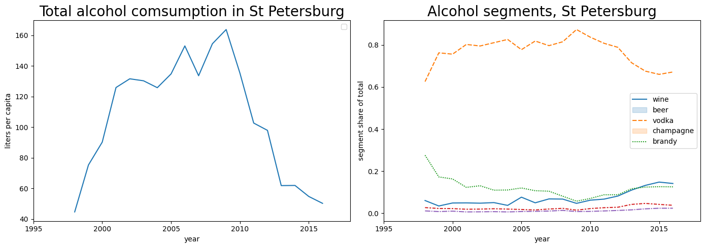
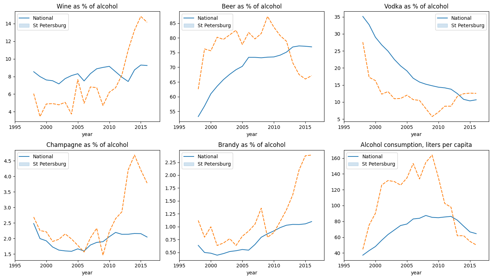
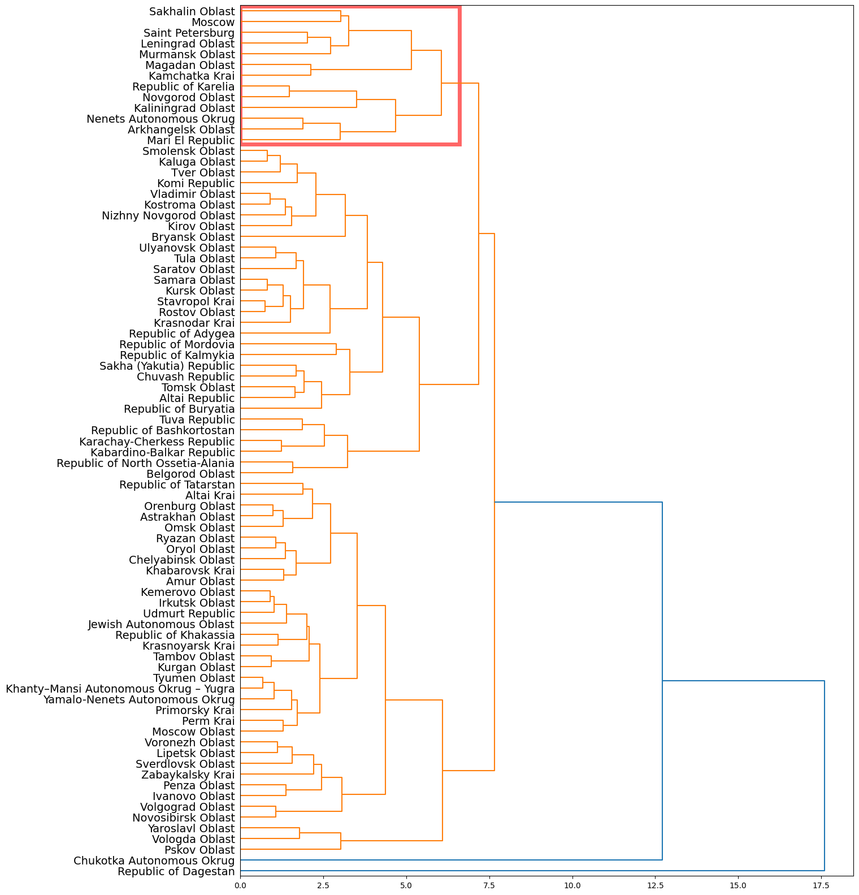
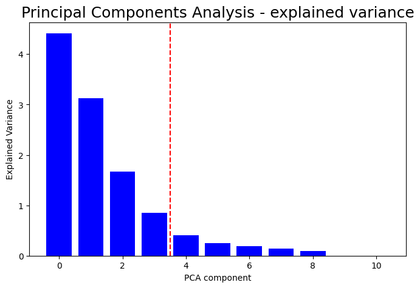

# Optimal Region for Drink Promotion: A Data-Driven Market Expansion Strategy

## Executive Summary
This project outlines a **data-driven strategy** for a wine company looking to expand its promotional efforts in Russia. With a **limited marketing budget**, the objective is to target a new region that mirrors the successful consumer base in **Saint Petersburg**. Using **historical alcohol consumption data** (1998–2016) and **unsupervised machine learning techniques**, we identified the **top 10 optimal regions** that share similar buying habits with St. Petersburg, maximizing the potential **return on investment**.

## Business Context
A beverage company has experienced significant success running promotions in **Saint Petersburg** and is now looking to expand. Due to **budget constraints**, launching a nationwide campaign is not feasible. 
The **strategic goal** is to pinpoint areas where the demographic and consumption trends closely resemble St. Petersburg, ensuring the new promotion resonates with the local population. 

## Data Overview & Preprocessing
The analysis leverages a comprehensive dataset of alcohol consumption across various Russian regions, spanning from **1998 to 2016**. 

### Data Cleaning
To ensure the integrity of the statistical analysis, several regions were excluded:
* **Incomplete Data**: Chechen Republic, Republic of Ingushetia, Republic of Dagestan, and Kabardino-Balkar Republic were removed due to sparse reporting or **significant outliers** that would skew the clustering results.
* **Feature Engineering**: Beyond raw sales volume, we calculated the **Market Share** of each alcohol segment (wine, beer, vodka, champagne, and brandy) relative to total consumption. This normalization allows us to compare consumer *preferences* regardless of the absolute population size or total consumption volume of a region.

## Exploratory Data Analysis (EDA)

Understanding the consumption trends in St. Petersburg was crucial for establishing our baseline.

*Above: Evolution of alcohol segments as a share of total consumption in St. Petersburg. Note the resilient interest in wine despite fluctuations in other segments.*

### St. Petersburg vs. National Trends
We further compared St. Petersburg against national averages to highlight its unique market dynamics:

*Above: St. Petersburg shows a distinct profile, often characterized by higher per-capita wine consumption compared to the national average, making it an ideal benchmark for this campaign.*

## Analytical Approach

To identify regions similar to St. Petersburg, we utilized a multi-layered **Unsupervised Machine Learning** workflow:

### 1. Hierarchical Clustering
We employed Hierarchical Clustering using the **Complete Linkage** method. Unlike Ward or Single linkage, Complete Linkage ensures that all members of a cluster are relatively similar to each other, creating more "compact" and reliable groupings.

*Above: Dendrogram illustrating the hierarchical grouping of regions. St. Petersburg was found in a cluster characterized by balanced, sophisticated alcohol consumption profiles.*

### 2. Dimensionality Reduction & Visualization
To verify the robustness of our clusters, we applied:
* **Principal Component Analysis (PCA)**: Reduced the high-dimensional feature space (market shares and growth rates) into two principal components that captured the majority of the data's variance.
* **t-SNE (t-Distributed Stochastic Neighbor Embedding)**: Specifically used to visualize how well-separated our clusters are in a 2D space.

*Above: t-SNE visualization confirming the distinct separation of the identified consumer clusters.*

## Selection Logic & Prediction
The final selection was not based on a single model but on the **intersection** of two clustering approaches (standard features and PCA-transformed features). This "consensus" approach reduces the risk of selecting a region based on algorithmic artifacts.

### Wine Consumption Prediction
To prioritize the final shortlist, we calculated a **Predicted Wine Consumption** metric using the following formula:
$$Wine_{pred} = Wine_{current} \times (1 + \frac{\Delta Wine_{share}}{Wine_{share}})$$

This formula adjusts the current consumption volume by the current growth momentum of wine's market share in that specific region.

## Final Recommendations

The following top 10 regions are recommended for expansion. These regions share a strong statistical resemblance to St. Petersburg's alcohol consumption habits and exhibit an upward trajectory in wine consumption.

| Rank | Region | Predicted Wine Consumption (L/capita) |
| :--- | :--- | :--- |
| 1 | Republic of Karelia | 12.01 |
| 2 | Novgorod Oblast | 11.01 |
| 3 | Komi Republic | 10.31 |
| 4 | Nenets Autonomous Okrug | 10.05 |
| 5 | Leningrad Oblast | 9.02 |
| 6 | Kaliningrad Oblast | 9.01 |
| 7 | Arkhangelsk Oblast | 8.99 |
| 8 | Smolensk Oblast | 8.64 |
| 9 | Murmansk Oblast | 8.61 |
| 10 | Bryansk Oblast | 7.90 |

### Strategic Insight
Geographically, most of these regions are located in the **North-West of Russia**. This suggests a strong regional correlation in consumer behavior, likely driven by similar climate, cultural influences, and supply chain proximity to Saint Petersburg.